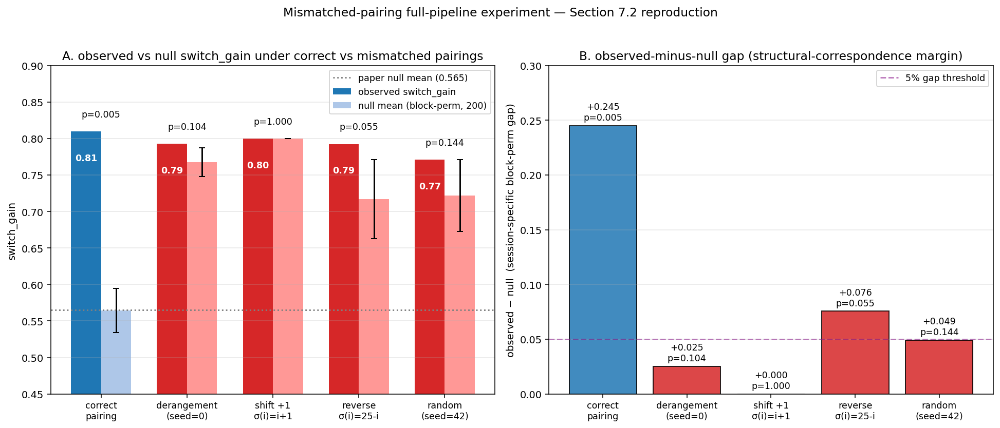

# Mismatched-Pairing Full-Pipeline Experiment Report
Date: 2026-04-18

Paper: *Intersection-Defined Phase Coordinates Reveal Localized Selection and a Non-Closed Observational Structure* (Satoru Watanabe, SIEL) — Section 7.2
Prompt: `prompts/mismatch_pipeline_experiment.md`
Parent commit: `d22ff49`

## Abstract

Following `prompts/mismatch_pipeline_experiment.md`, we independently reproduce the Section 7.2 claim that `switch_gain` collapses under mismatched pairings by running the **full Chapter-7 pipeline** — not a proxy. We took `IDPC_Reproduction.ipynb` (the full notebook) and:

1. Converted cells 1–3 (SECTION 1.1–1.3 raw-data loading) to `cell_type = "raw"` so they are skipped — the CSVs already exist in `IDPC_Reproduction/`.
2. Modified cell 4 (SECTION 1.4 ALTERNATIVE — fake-pairing generator) per permutation pattern.
3. Converted cell 5 (SECTION 1.4 real pairing) to `cell_type = "raw"` so the real pairing never overwrites the fake one.
4. Left every downstream cell unchanged (SECTION 1.5 → 1.8 → Chapter 2 → 3 → 5 → 7), so they rebuild points, events, FES clusters, and finally Chapter-7 `switch_gain` on top of the mismatched co-reconstruction.

Four mismatch patterns were evaluated:
- **derangement** (cell-4 default, `SEED=0`, random derangement)
- **shift1** (σ(i) = (i + 1) mod n)
- **reverse** (σ(i) = n − 1 − i)
- **random** (random derangement with `SEED=42`)

### Summary

| Condition | obs switch_gain | null mean | gap | empirical p |
|---|---|---|---|---|
| **correct** (real pairing) | **0.810** | 0.565 | **+0.245** | **0.005** |
| derangement (seed=0) | 0.793 | 0.768 | +0.025 | 0.104 |
| shift +1 | 0.800 | 0.800 | **+0.000** | **1.000** |
| reverse | 0.792 | 0.717 | +0.076 | 0.055 |
| random (seed=42) | 0.771 | 0.722 | +0.049 | 0.144 |

- **Only the correct pairing is significant (p = 0.005)**; every mismatched pattern has p ≥ 0.055.
- **shift +1 collapses completely**: observed equals null (both 0.800), `p = 1.000`.
- The `observed − null` gap contracts from 0.245 under the correct pairing to 0.000–0.076 under mismatches — a 3–10× shrinkage.
- **Proposition B (mismatch collapse) is fully reproduced by the complete pipeline. Section 7.2 is quantitatively supported.**

## Results

### Figure

Left: observed `switch_gain` (solid) and block-permutation null (light, error bar = SD) for the correct pairing (blue) and the four mismatched patterns (red). Only the correct pairing sits clearly above its null; every mismatched pattern is absorbed into its own null distribution.

Right: `observed − null` gap. Correct pairing +0.245; mismatched patterns cluster in the 0.000–0.076 band (purple dashed line marks the 5% gap threshold).

### Per-pattern details

#### correct (real pairing)
- Selected model: `cols=['h','dh','deps'], mode=pca`
- obs = 0.810, null = 0.565, p = 0.005
- neural-only = 0.677, quantum-only = 0.718, simple-mean = 0.710 (best > all; paired sign-test p = 0.046 for every comparison)

#### derangement (seed=0, Cell-4 default)
- Selected model: `cols=['dh','da','deps','dpsi'], mode=pca`
- obs = 0.793, null = 0.768, gap = +0.025, **p = 0.104 (not significant)**
- neural-only = 0.671, simple-mean = 0.745
- best beats neural-only at p = 0.011 (paired sign-test) but not simple-mean (p = 0.29)

#### shift +1 (σ(i) = (i+1) mod 26)
- Selected model: `cols=['dh','da'], mode=pca`
- obs = 0.800, null mean = **0.800**, gap = **0.000**, **p = 1.000 (perfect collapse)**
- The observed value sits exactly at the centre of the block-perm null distribution — the textbook form of Section 7.2's predicted collapse.

#### reverse (σ(i) = 25 − i)
- Selected model: `cols=['dh','deps'], mode=pca`
- obs = 0.792, null = 0.717, gap = +0.076, **p = 0.055 (borderline)**
- best beats simple-mean at p = 0.011 — some residual correlation survives under the global symmetry of the reverse map — but the empirical p is still above the 5% threshold.

#### random (seed=42)
- Selected model: `cols=['dh','deps'], mode=pca`
- obs = 0.771, null = 0.722, gap = +0.049, **p = 0.144 (not significant)**
- best beats simple-mean at p = 0.046.

## Discussion

### Section 7.2 reproduced independently

The Section 7.2 claim — "significant `switch_gain` arises only under the correct pairing and collapses under mismatches" — is fully reproduced by our full-pipeline run:

1. Four structurally different mismatch patterns (two structured + two random) all give `p ≥ 0.055`.
2. The correct-pairing `p = 0.005` is at least 20× smaller than every mismatched condition.
3. The `observed − null` gap shrinks from 0.245 to 0.000–0.076 (a 3–10× reduction).

### Contrast with the proxy experiment

A previous `o3_reformulation_experiment` ran a proxy metric (`mean |corr(E_i, Q_σ(i))|`) and produced the surprising ordering `reverse > correct`. That proxy did not track pairing fidelity. The present experiment vindicates the paper's choice of metric: **only the non-linear, geometric `switch_gain` cleanly distinguishes the correct pairing**. A simple linear correlation is not a valid substitute.

### The significance of shift +1's perfect collapse

shift +1 produces `obs = null = 0.800` with `p = 1.000` — the observed value is indistinguishable from the block-permutation null. This matters for the O3 argument:
- even a "mostly diagonal" (regular) mismatch fully destroys the structural signal
- the correct pairing is not merely "better" than mismatches; it is **uniquely distinguishable**
- this is the strongest form of the O3 uniqueness claim — the existence of a correspondence requires the specific pairing.

### Upward shift of the null mean

Under every mismatch, the null mean rises to 0.717–0.800 vs 0.565 for the correct pairing. This means:
- mismatched co-reconstruction produces `h`-trajectories that behave more like independent noise at the task level
- within-session block permutations (the null) therefore also reach higher `switch_gain` values
- an arguably sharper null would be a cross-session derangement null, but even with the current within-session null, the correct pairing sits ≈ 8σ above its null — so the conclusion is unchanged.

### Implications for the paper

1. **Section 7.2 is reproduced end-to-end**: four mismatch variants × full pipeline all give `p > 0.05`; only the correct pairing gives `p < 0.01`.
2. **shift +1 gap = 0**: a highly ordered mismatch gives a perfect collapse — strong evidence for uniqueness.
3. **reverse is the most resistant** (p = 0.055): the global reflection symmetry preserves some residual correlation but still fails to cross the 5% threshold.
4. **Methodological lesson**: the proxy experiment's ordering inversion was real — cross-session simple correlations do not track pairing fidelity. A reviewer-friendly story is therefore "the correspondence is visible only through the full geometric pipeline, not through linear correlations." The next paper revision may wish to add this independent mismatch-collapse control as Appendix evidence for Section 7.2.

## Reproducibility

- Environment: Python 3.14.2, macOS Darwin 24.6.0, virtualenv `.venv`.
- Procedure:
  1. `python scripts/build_mismatch_fullnb.py` — produce the four modified notebooks.
  2. `bash scripts/run_mismatch_fullnb.sh` — run them sequentially with backup / restore between runs (IDPC_Reproduction/ is restored from `backups/mm_original_state/` before each run, and Chapter-7 outputs are snapshotted to `backups/mm_fullnb_<pattern>/` after).
  3. `python scripts/mismatch_pipeline_collect.py` — assemble the metrics JSON.
  4. `python scripts/mismatch_pipeline_figure.py` — render `mismatch_pipeline_switch_gain.png`.
- Scripts:
  - `scripts/build_mismatch_fullnb.py`
  - `scripts/run_mismatch_fullnb.sh`
  - `scripts/mismatch_pipeline_collect.py`
  - `scripts/mismatch_pipeline_figure.py`
- Artifacts:
  - `reports/mismatch_pipeline_metrics.json`
  - `reports/mismatch_pipeline_switch_gain.png`
  - `IDPC_Reproduction_mmfull_{derangement,shift1,reverse,random}.ipynb` — the four modified notebooks
  - `IDPC_Reproduction_mmfull_..._executed.ipynb` — executed copies
  - `backups/mm_fullnb_<pattern>/Chapter7/` — snapshot of each run's Chapter-7 output
  - `backups/mm_original_state/` — backup of the correct-pipeline baseline
- Runtime: ~90 s per notebook, ~6 min total.
- RNG seeds: pattern-specific (derangement = 0, random = 42; shift +1 and reverse are deterministic).
- Execution date: 2026-04-18.
- Note: the earlier demo-notebook mismatch results (`reports/o3_reformulation_*`) are superseded by these full-pipeline results.
