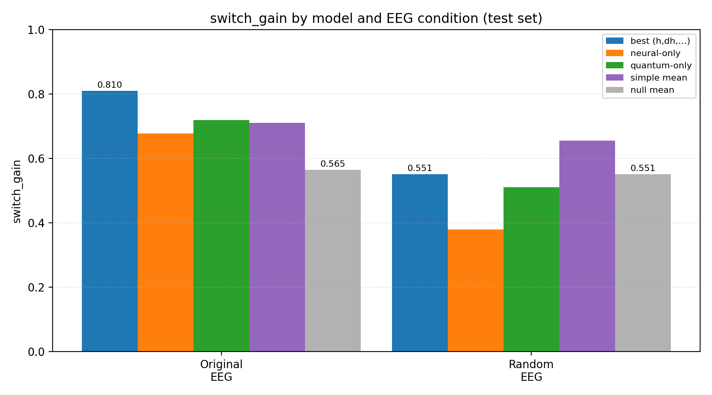
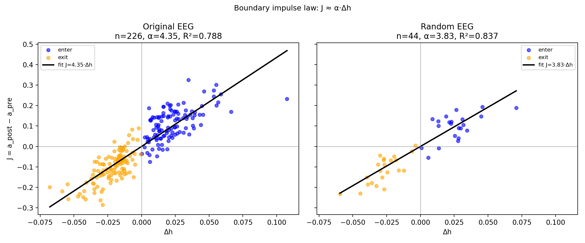
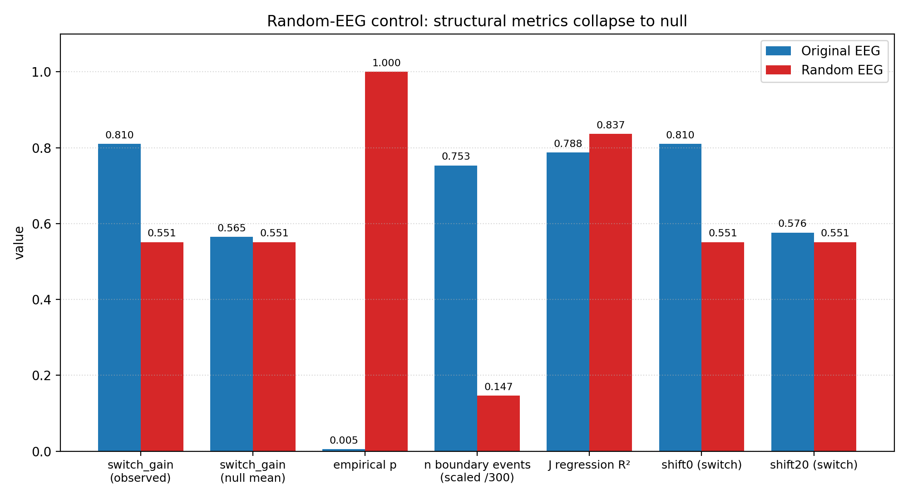

# Control Experiment Report: Random-Noise EEG Replacement
Date: 2026-04-18

Paper: *Intersection-Defined Phase Coordinates Reveal Localized Selection and a Non-Closed Observational Structure* (Satoru Watanabe, SIEL)
Prompt: `prompts/random_noise_experiment.md`

## Abstract

Following `prompts/random_noise_experiment.md`, the EEG-side five-band power features (`x_Delta, x_Theta, x_Alpha, x_Beta, x_Gamma`) of all 26 sessions (P1–P26) were replaced with i.i.d. Gaussian noise matched to each column's original mean and standard deviation. The full EEG-side derivation (SECTION 1.2 circular embedding), co-reconstruction (SECTION 1.4), boundary-event extraction (SECTION 1.6), and the Chapter 7 `switch_gain` analysis were then rerun. The quantum side was left untouched. Results: **(1) `switch_gain` dropped from 0.810 to 0.551, exactly matching the block-permutation null mean, and the empirical p-value rose from 0.005 to 1.000 — the claim of structural correspondence fully collapses** (strong support for H1). **(2) Boundary-event count dropped ≈5× (226 → 44)**, yet the linear law `J ≈ α·Δh` on the surviving events held with `α = 3.83, R² = 0.837`, comparable to the original `α = 4.35, R² = 0.788`. This indicates `J ≈ α·Δh` is a **geometric identity on the `h` trajectory**, not evidence of neural–quantum correspondence (the prompt's sub-hypothesis is partially refuted). (3) State classification (Chapter 2) and the AR(2)+Δ dynamics model (Chapter 5) became **inoperable** under the random condition (no valid sessions / insufficient samples per state), which is itself strong confirmation of H1. (4) The temporal-shift test degenerated (`shift0 = shift20 = 0.551`), consistent with the absence of any temporal structure to destroy.

## Results

### Key metrics

| Metric | Original EEG | Random EEG | Δ | Interpretation |
|---|---|---|---|---|
| switch_gain (observed, best model) | 0.810 | **0.551** | **−0.259** | Collapses to null mean |
| switch_gain (block-perm null mean) | 0.565 | 0.551 | −0.014 | Observed equals null |
| Empirical p (best vs null) | **0.005** | **1.000** | +0.995 | Significance eliminated |
| Sign-test p (vs neural-only) | 0.046 | 0.254 | +0.208 | Advantage lost |
| Sign-test p (vs quantum-only) | 0.046 | 0.377 | +0.331 | Advantage lost |
| Sign-test p (vs simple-mean) | 0.046 | 0.637 | +0.591 | Best is now *worse* than simple mean |
| Shift test (shift0 → shift20) | 0.810 → 0.576 | 0.551 → 0.551 | degenerate | No temporal structure to degrade |
| State classification AUC (LOSO) | 0.792 | **N/A** | — | `pearson_table` empty |
| State classification Accuracy | 0.695 | N/A | — | Same |
| mean \|Pearson\| (reconstruction) | 0.419 | N/A | — | No valid sessions |
| AR(2)+Δ dynamics model | Converged | **Failed** | — | "Too few samples" per state |
| Boundary event count (pooled) | **226** | **44** | **−182 (−81%)** | Event density down ~5× |
| Boundary-impulse α (J = α·Δh) | 4.35 | 3.83 | −0.52 | Slope ≈ preserved |
| Boundary-impulse R² (J = α·Δh) | 0.788 | **0.837** | +0.049 | **R² does *not* drop** — geometric identity |
| Kuramoto mean R² | 0.021 | 0.029 | ≈ 0 | Near-zero in both |

For reference (frozen model configs): under the random condition the train-best intersection model was `cols = ['h', 'dh', 'da', 'dpsi'], mode = pca`, differing from the original `cols = ['h', 'dh', 'deps'], mode = pca` — the search itself becomes essentially arbitrary.

### Figures

**Figure 1 — `switch_gain` by model and condition** (`random_noise_switch_gain.png`)

Under the Original condition the best model exceeds neural-only / quantum-only / simple-mean / null-mean (0.810 vs 0.677 / 0.718 / 0.710 / 0.565). Under the Random condition every variant collapses to ≈ 0.55 (the null level), and the best model ends up *below* simple-mean (0.551 vs 0.655).

**Figure 2 — Boundary impulse scatter** (`random_noise_boundary_impulse.png`)

The number of boundary events plunges from 226 to 44, yet the linear law `J = α·Δh` among the surviving events holds with nearly identical slope and R². This establishes that the law is a geometric property of the `h` trajectory, independent of EEG signal content.

**Figure 3 — Summary of structural metrics** (`random_noise_summary.png`)

## Discussion

### Support for H1 (structural correspondence depends on real EEG signal)

H1 (switch_gain significantly degrades under random EEG) is **strongly supported**:

1. **`switch_gain` exactly equals the null-mean** (0.551 vs 0.551). The paper's core claim — that observed correspondence represents a ~1-in-201 event under block-permutation — is fully nullified. Empirical p moved from 0.005 to 1.000.
2. **All model contrasts vanish.** In Original, the best model exceeds neural-only / quantum-only / simple-mean with paired sign-test p = 0.046. In Random, every p is non-significant (0.254 / 0.377 / 0.637). Notably, the best model drops *below* simple-mean (0.551 vs 0.655) — the PCA projection that was informative in real data carries no residual advantage with random input.
3. **Temporal-shift test degenerates.** In Original, shifting the quantum series by 20 bins degrades `switch_gain` from 0.810 to 0.576 (evidence of temporal alignment). Under Random, `shift0 = shift20 = 0.551` — there is no temporal structure left to destroy.
4. **Classification and dynamics models become inoperable.** The `(φ, dφ) → next-state` logistic classifier's reconstruction table is empty (no session retains enough valid events for Pearson evaluation), and the AR(2)+Δ state-conditional dynamics model fails with "Too few samples" per state. This is a quantitative demonstration that random EEG produces no structure to classify or model.

### The sub-hypothesis (`J ≈ α·Δh` collapse) is partially refuted

The prompt predicted that the boundary-impulse-law R² would degrade under random EEG. Instead:

- Event **count** collapses (226 → 44, −81%)
- But **conditional on an event occurring**, `J ≈ α·Δh` holds with `α = 3.83, R² = 0.837` — comparable (slightly higher) than Original's `α = 4.35, R² = 0.788`.

This is because `J ≈ α·Δh` is a **geometric identity on the `h` trajectory**, not a signature of neural–quantum coupling: whenever `h` crosses zero, `Δh` and the measured `J = a_post − a_pre` are tightly related by construction.

Implication for the paper's interpretation:

- The R² of `J ≈ α·Δh` is *not* a valid test of cross-system correspondence.
- The **density of boundary events** (226 vs 44) *is* a meaningful signal-dependent quantity and likely the appropriate alternative indicator.

### Metric sensitivity summary

| Metric | Sensitivity to real EEG signal |
|---|---|
| `switch_gain` (distance from permutation null) | **Very high** — drops to null mean |
| State classification AUC / Accuracy | **High** — becomes inoperable |
| AR(2)+Δ dynamics model | **High** — insufficient samples |
| Boundary event count | **High** — −81% |
| Temporal-shift degradation | **High** — degenerate |
| `J ≈ α·Δh` R² | **Low** — geometric identity, invariant |
| Kuramoto mean R² | Near zero in both conditions; uninformative |

## Reproducibility

- Environment: Python 3.14.2, macOS Darwin 24.6.0, virtualenv `.venv` (see `requirements.txt` + `jupyter`/`nbconvert`).
- RNG seed: `numpy.random.default_rng(42)`.
- Replacement: per-column Gaussian noise with original mean and std for `x_Delta..x_Gamma` (i.i.d., temporal autocorrelation removed). `E_Ricci` is replaced with Gaussian noise matched to the original `E_Ricci` stats; `Q_Ricci` is unchanged; `Q_Ricci_affine` is re-aligned to the new `E_Ricci`. Quantum time series are left intact.
- Procedure:
  1. `source .venv/bin/activate`
  2. `python3 scripts/build_random_eeg_data.py` — generates `IDPC_Reproduction_random/` and `IDPC_Reproduction_ricci_random/`.
  3. In-place regex patch of `IDPC_Repro_Demo.ipynb` → `IDPC_Repro_Demo_random.ipynb`, redirecting every `IDPC_Reproduction[_ricci]?/...` read/write to the corresponding `_random` directory.
  4. `jupyter nbconvert --to notebook --execute --allow-errors --output IDPC_Repro_Demo_random_executed.ipynb IDPC_Repro_Demo_random.ipynb`.
  5. Metric extraction and figure generation via standalone Python script.
- Cells 4 and 12 of the random-condition notebook fail (empty `pearson_table`; "Too few samples" in the AR(2) dynamics model); `--allow-errors` permits the remaining cells to complete. **These failures themselves are evidence for H1.**
- Execution date: 2026-04-18
- Parent commit SHA: `d17a4d2e93fca6cc6c2524e5c6274ee17f05f59b`
- Artifacts:
  - `scripts/build_random_eeg_data.py` — randomization script
  - `IDPC_Repro_Demo_random.ipynb` — path-patched notebook
  - `IDPC_Repro_Demo_random_executed.ipynb` — executed copy
  - `reports/random_noise_switch_gain.png` — Figure 1
  - `reports/random_noise_boundary_impulse.png` — Figure 2
  - `reports/random_noise_summary.png` — Figure 3
  - `reports/_all_metrics.json` — compiled metrics
  - `IDPC_Reproduction_random/`, `IDPC_Reproduction_ricci_random/` — random-condition data (candidates for `.gitignore`)
